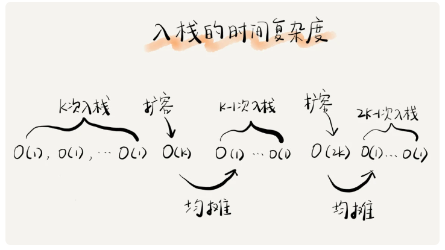
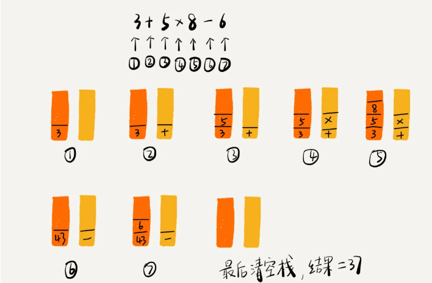
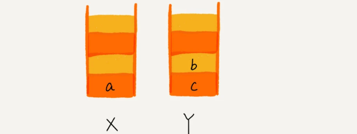
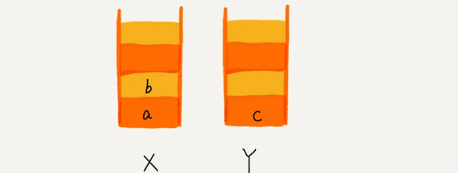

# [stack 栈结构详细介绍](https://time.geekbang.org/column/article/41222?utm_source=pinpaizhuanqu&utm_medium=geektime&utm_campaign=guanwang&utm_term=guanwang&utm_content=0511)<i class="fa fa-external-link"></i>

>&#128227; [【栈算法题库】](./../database/03_stack.md)

## 1.栈是什么？
栈是一种`操作受限`的线性表, 只允许在一端插入和删除数据。特点就是`后进者先出，先进者后出`。

## 2.为什么使用"操作受限"的栈？
- 功能上来说，数组或链表确实可以替代栈，但要知道，特定的数据结构是对特定场景的抽象
- 数组或链表暴露了太多的操作接口，操作上的确灵活自由，但使用时就比较不可控，自然也就更容易出错。

## 3.如何实现一个"栈"?
基于栈的定义，可以确定栈包含两个操作: `入栈`、`出栈`。实现的方式也分为两种：基于数组的`顺序栈`、基于链表的`链式栈`。

### 3.1顺序栈
```go
package new_stack

var _ Stack = (*ArrayStack)(nil)

type ArrayStack struct {
	data []any
	top  int
}

func NewArrayStack() *ArrayStack {
	return &ArrayStack{
		data: make([]any, 32),
		top:  -1,
	}
}

// Push 入栈
func (s *ArrayStack) Push(v any) {
	if s.top == cap(s.data)-1 {
		return
	}

	s.top += 1
	s.data[s.top] = v
}

// Pop 出栈
func (a *ArrayStack) Pop() any {
	if a.IsEmpty() {
		return nil
	}

	v := a.data[a.top]
	a.top--
	return v
}

// IsEmpty 是否为空
func (a *ArrayStack) IsEmpty() bool {
	return len(a.data) == 0 && a.top == -1
}

// Flush 清空
func (a *ArrayStack) Flush() {
	a.top = -1
}

// Top 置顶元素
func (a *ArrayStack) Top() any {
	if a.IsEmpty() {
		return nil
	}

	return a.data[a.top]
}
```

### 3.2链式栈
```go
package new_stack

type node struct {
	val  any
	next *node
}

var _ Stack = (*LinkedListStack)(nil)

type LinkedListStack struct {
	top *node
}

func NewLinkedStack() *LinkedListStack {
	return &LinkedListStack{}
}

// Push 入栈
func (l *LinkedListStack) Push(val any) {
	l.top = &node{val: val, next: l.top}
}

// Pop 出栈
func (l *LinkedListStack) Pop() any {
	if l.IsEmpty() {
		return nil
	}

	node := l.top
	l.top = l.top.next
	return node.val
}

// IsEmpty 是否为空
func (l *LinkedListStack) IsEmpty() bool {
	return l.top == nil
}

// Top 置顶元素
func (l *LinkedListStack) Top() any {
	if l.IsEmpty() {
		return nil
	}
	return l.top.val
}

// Flush 清空
func (l *LinkedListStack) Flush() {
	l.top = nil
}
```

## 4. 空间复杂度和时间复杂度
- 空间复杂度：指除了原本的数据存储空间外，算法运行还需要额外的存储空间。而`顺序栈` 和 `链表栈` 除了存储固定的N个元素空间外，需要额外的一两个临时变量存储空间，所以空间复杂度是O(1)
- 时间复杂度：`顺序栈` 和 `链表栈` 的`入栈`、`出栈`操作只涉及栈顶相关元素，所以复杂度是O(1)

## 5. 动态扩容的复杂度
### 5.1 顺序栈
- 出栈：对于出栈操作来说，不涉及内存的重新申请和数据搬移，所以出栈的时间复杂度是O(1)
- 入栈：最好情况时间复杂度是 O(1)，最坏情况时间复杂度是 O(n)。那平均情况下的时间复杂度O(1)`[使用摊还分析法]`
  


## 6. 栈的应用
### 6.1 栈在函数中的应用
```go
package main

import "fmt"

func main() {
    fmt.Println(add(2, 3))
}

func add(a, b int) int {
    return a + b
}
```
在上面示例中，我们定义了一个 add 函数，用于将两个整数相加并返回结果。在 main 函数中，我们调用了 add 函数，并将结果打印出来。

当程序运行时，以下是函数调用栈的基本原理和步骤：
- main 函数被调用，将 main 函数的返回地址和其他相关信息压入栈顶。
- main 函数调用 add 函数，将 add 函数的返回地址和参数值 2 和 3 压入栈顶。
- add 函数执行，将参数 2 和 3 相加得到结果 5，将结果存储在局部变量中。
- add 函数执行完毕，弹出栈顶的 add 函数调用信息，返回到 main 函数的下一条指令。
- main 函数继续执行，将 add 函数的返回值 5 打印出来。
程序执行完毕，栈中不再有函数调用信息。

这个过程中，栈的作用是维护函数调用关系和局部变量的存储。每个函数的调用都会在栈顶创建一个栈帧（stack frame），栈帧中包含了函数的返回地址、参数、局部变量等信息。栈帧的大小取决于函数所需的内存空间。

当函数执行完毕返回时，对应的栈帧会被弹出，栈顶指针回到上一个函数的栈帧，继续执行上一个函数的剩余部分。

底层实现方面，具体的栈管理和内存分配由编译器和运行时系统负责。它们负责栈的大小分配、栈帧的创建和销毁，以及内存共享等优化技术。每个线程通常都有自己的栈，用于管理函数调用和局部变量。

需要注意的是，栈的大小是有限的，如果函数嵌套层级过深或递归调用过多，可能会导致栈溢出错误。此时，栈无法为新的函数调用提供足够的空间，导致程序崩溃。

### 6.2 栈在表达式求值的应用
使用栈运算下面这个表达式：`34+13*9+44-12/3`;

实现原理：
1. 前提条件需要两个栈：一个存储操作数，一个存储运算符。
2. 遍历顺序：从左到右，`遇到数字压入操作数栈`, `遇到运算符就与运算符栈的栈顶元素进行比较`
3. 运算符比较规则：
   1. 运算符栈顶元素优先级高，将当前运算符压入栈。
   2. 运算符栈顶元素优先级低或相等，从运算符栈中取栈顶运算符，从操作数栈的栈顶取 2 个操作数，然后进行计算，再把计算完的结果压入操作数栈，继续比较。

  

### 6.3 栈在括号匹配中的应用
检查样例`[({[()]})]` 这个括号是否合法。
> 所谓的合法是指: [], (), {} 皆是`成对`出现。

实现原理：
1. 遇到左括号压入栈中
2. 遇到右括号弹出栈
3. 验证栈是否为空, 检查是否合法。

### 6.4 浏览器的前进和后退功能
实现原理：
1. 前提条件需要两个栈：一个X栈，一个Y栈。
2. 浏览新页面压入`X栈`
3. 后退时候从`X栈`弹出，并将弹出页面压入`Y栈`
4. 如在前进，则从`Y栈`弹出，并将弹出页面压入`X栈`
5. 如果在`X栈`中的页面打开一个新的页面，则清空`Y栈`

> 注意
> 1. 如果`Y栈`没有数据也就没有办法进行`前进`
> 2. 如果`X栈`没有数组也就没有办法进行`后退` 

demo:
1. 顺序查看了 a，b，c 三个页面，我们就依次把 a，b，c 压入栈。


2. 通过浏览器的后退按钮，从页面 c 后退到页面 a 之后，我们就依次把 c 和 b 从栈 X 中弹出，并且依次放入到栈 Y。


3. 点击前进按钮回到 b 页面，我们就把 b 再从栈 Y 中出栈，放入栈 X 中。


4. 通过页面 b 又跳转到新的页面 d 了，页面 c 就无法再通过前进、后退按钮重复查看了，所以需要清空栈 Y。
