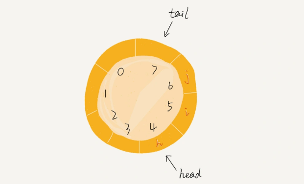

# [queue 队列结构详细介绍](https://time.geekbang.org/column/article/41330?utm_source=pinpaizhuanqu&utm_medium=geektime&utm_campaign=guanwang&utm_term=guanwang&utm_content=0511)<i class="fa fa-external-link"></i>

>&#128227; [【队列算法题库】](./../database/04_queue.md)

## 1.队列是什么？
队列（Queue）是一种`操作受限的线性表数据结构`, 具有先进先出（FIFO）的特性。

## 2.如何实现一个"队列"?
基于队列的定义，可以确定栈包含两个操作: `入队`、`出对`。实现的方式也分为两种：基于数组的`顺序队列`、基于链表的`链式队列`。

### 2.1顺序队列
```go
package new_queue

var _ Queue = (*ArrayQueue)(nil)

type ArrayQueue struct {
	data     []any
	capacity int
	head     int
	tail     int
}

func NewArrayQueue(capacity int) *ArrayQueue {
	return &ArrayQueue{
		data:     make([]any, capacity),
		head:     0,
		tail:     0,
		capacity: capacity,
	}
}

// EnQueue 入队
func (q *ArrayQueue) EnQueue(v any) bool {
	if q.tail == q.capacity {
		if q.head == 0 {
			return false
		}
		for i := q.head; i < q.tail; i++ {
			q.data[i-q.head] = q.data[i]
		}
		q.tail -= q.head
		q.head = 0
	}
	q.data[q.tail] = v
	q.tail++
	return true
}

// DeQueue 出对
func (q *ArrayQueue) DeQueue() any {
	if q.head == q.tail {
		return nil
	}

	v := q.data[q.head]
	q.head++

	return v
}
```
### 2.2链表队列
```go
package new_queue

type Node struct {
	Val  any
	Next *Node
}

var _ Queue = (*LinkedListQueue)(nil)

type LinkedListQueue struct {
	head   *Node
	tail   *Node
	length int
}

func NewLinkedListQueue() *LinkedListQueue {
	return &LinkedListQueue{
		head:   nil,
		tail:   nil,
		length: 0,
	}
}

// EnQueue 入队
func (q *LinkedListQueue) EnQueue(v any) bool {
	node := &Node{Val: v}
	if q.tail == nil {
		q.tail = node
		q.head = node
	} else {
		q.tail.Next = node
		q.tail = node
	}
	q.length++
	return true
}

// DeQueue 出对
func (q *LinkedListQueue) DeQueue() any {
	if q.head == nil {
		return nil
	}

	v := q.head.Val
	q.head = q.head.Next
	q.length--
	return v
}
```

## 3.循环队列
循环队列顾名思义：队列的头尾相连。
循环队列判断条件：
- 是否满：(tail + 1) % n == head
- 是否空：tail == head


> 优势：使用循环队列可以解决队列在`tail == n`的时候数据搬移操作浪费的时间。
> 劣势：循环队列会浪费一个数组的存储空间

```go
package new_queue

var _ Queue = (*CycleArrayQueue)(nil)

type CycleArrayQueue struct {
	data     []any
	capacity int
	head     int
	tail     int
}

func NewCycleArrayQueue(capacity int) *CycleArrayQueue {
	return &CycleArrayQueue{
		data:     make([]any, capacity),
		capacity: capacity,
		head:     0,
		tail:     0,
	}
}

// DeQueue 出对
func (q *CycleArrayQueue) DeQueue() any {
	if q.tail == q.head {
		return nil
	}
	v := q.data[q.head]
	q.head = (q.head + 1) % q.capacity
	return v
}

// EnQueue 入队
func (q *CycleArrayQueue) EnQueue(v any) bool {
	if (q.tail+1)%q.capacity == q.head {
		return false
	}
	q.data[q.tail] = v
	q.tail = (q.tail + 1) % q.capacity
	return true
}
```